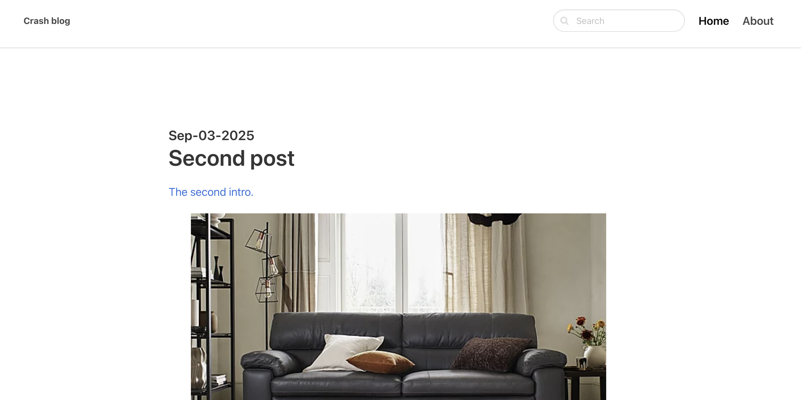

# Crashblog
## Functionality
 Categories, comments, search, multimedia posts, handling on user and admin side
## Technologies
 Python, Django, ORM, Admin, React, HTML/CSS

## Screenshots

  
  
  

